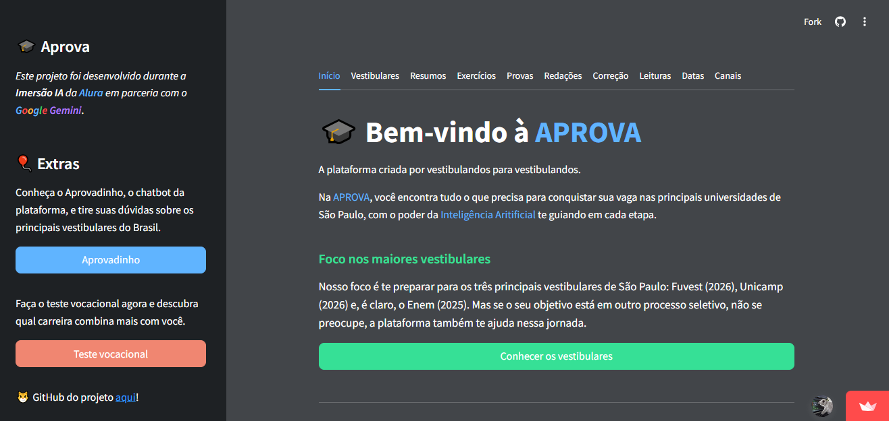
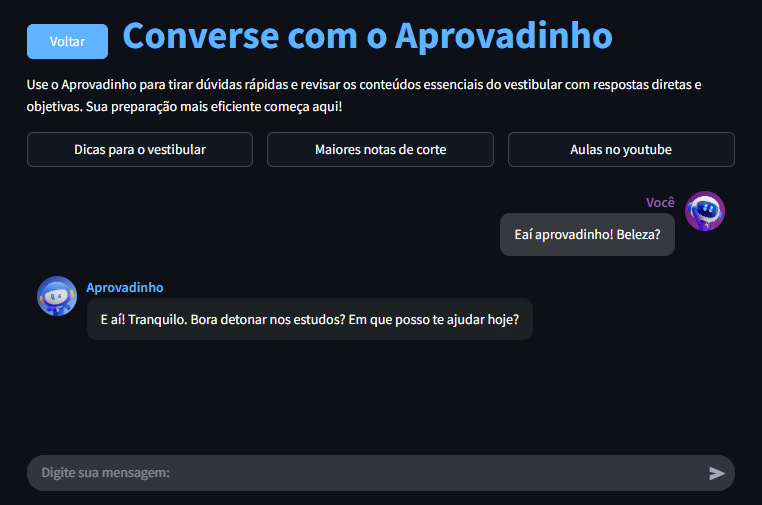
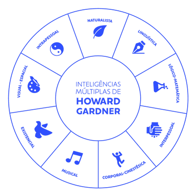
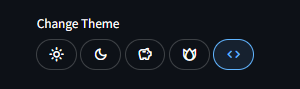

<div align="center">
  <a href="https://projeto-aprova.streamlit.app">
    
  </a>
</div>
<br>
<p align="center">
  <a href="https://projeto-aprova.streamlit.app" target="_blank" rel="noopener noreferrer">
    
  </a>
  <a href="https://github.com/matheusaudibert/projeto-aprova/stargazers">
    
  </a>
  <a href="https://github.com/matheusaudibert/projeto-aprova/forks">
    
  </a>
</p>

# 🎓 Plataforma Aprova

Plataforma inteligente com IA para ajudar na sua preparação para os principais vestibulares de SP, com conteúdos personalizados e ferramentas que otimizam seus estudos.



## 🌍 Acesso

Para começar a usar a plataforma, basta acessar o [link](https://projeto-aprova.streamlit.app):

```
https://projeto-aprova.streamlit.app
```

## 🤖 Aprovadinho

O **Aprovadinho** é um **chatbot inteligente** criado para te acompanhar em cada etapa da sua preparação para o vestibular, oferecendo respostas rápidas, resumos objetivos, dicas estratégicas e orientações personalizadas que facilitam sua jornada rumo à aprovação.



## 🧠 Teste Vocacional

Descubra quais áreas combinam com você e quais cursos mais se alinham com seus interesses, talentos e estilo de vida. Com o nosso teste vocacional, você encontra **clareza para tomar decisões mais seguras sobre seu futuro acadêmico e profissional**. É rápido, prático e pode te ajudar a enxergar caminhos que você talvez ainda não tenha considerado.



## 🔧 Funcionalidades

A plataforma Aprova foi criada para ser sua aliada na preparação para os vestibulares mais concorridos do Brasil. Pensando nisso, reunimos uma série de funcionalidades essenciais que vão te ajudar a estudar de forma mais eficiente, organizada e direcionada. Conheça abaixo tudo o que você pode aproveitar por aqui:

| **Funcionalidade**  | **Descrição**                                                                                                       |
| ------------------- | ------------------------------------------------------------------------------------------------------------------- |
| **🎯 Vestibulares** | Informações completas sobre os principais vestibulares do Brasil, como ENEM, Fuvest e Unicamp.                      |
| **📚 Resumos**      | Resumos gerados por IA sobre as principais matérias cobradas nos vestibulares, ideais para revisão rápida.          |
| **✍ Exercícios**   | Exercícios gerados por IA com base nos conteúdos mais cobrados — e você pode resolvê-los diretamente na plataforma. |
| **📝 Provas**       | Provas dos anos anteriores, organizadas com gabaritos e resoluções explicadas.                                      |
| **✏️ Redações**     | Redações nota máxima de edições anteriores, para você entender o que é uma boa estrutura e argumentação.            |
| **📖 Leituras**     | Lista de livros obrigatórios dos vestibulares, com resumos, análises e contextualizações.                           |
| **📅 Datas**        | Datas importantes dos vestibulares com possibilidade de adicionar diretamente ao Google Agenda.                     |
| **▶️ Canais**       | Sugestões dos melhores canais do YouTube voltados para vestibulandos, organizados por disciplina.                   |

## 🤔 Contexo do projeto

Este projeto foi desenvolvido durante a **Imersão IA**, uma iniciativa da [**Alura**](https://www.alura.com.br) em parceria com o [**Google Gemini**](https://gemini.google.com/app), com o objetivo de explorar o potencial da inteligência artificial generativa. O desafio proposto era criar uma aplicação inovadora utilizando exclusivamente a API do Google Gemini. A partir disso, nasceu a **Plataforma Aprova**, uma solução completa para vestibulandos, combinando IA, conteúdo educacional e uma experiência personalizada para auxiliar na preparação para os principais exames do país.

<div style="display: flex; justify-content: center;">
  
  
</div>

## 💻 Tecnologias

Esta plataforma foi desenvolvida utilizando [**Streamlit**](https://github.com/streamlit/streamlit), uma biblioteca em Python que facilita a criação de aplicações web interativas e rápidas.

Para algumas funcionalidades inteligentes, como geração de resumos e exercícios, correção de redações, chatbot aprovadinho e o teste vocacional, foi utilizada a [**API do Google Gemini**](https://ai.google.dev/gemini-api/docs?hl=pt-br), que traz o poder da inteligência artificial generativa para a plataforma.

## 😸 Contribuições

Contribuições, ideias novas e sugestões são sempre muito bem-vindas!
Se você quiser ajudar a melhorar este projeto, fique à vontade para abrir issues, enviar **pull requests** ou **compartilhar suas ideias**.

## 🎈 Curiosidade

A plataforma possuia 5 temas disponíveis _(foram removidos por inconsistência)_: **light**, **dark** e **mais três outros temas especiais**.
Esses temas extras foram inspirados em estilos de temas muito populares, como os do [**GitHub**](), [**Discord**](https://discord.com) e o [**Dracula Theme**](https://github.com/dracula/dracula-theme), que é um tema bastante usado no VS Code, e detalhe, _**é brasileiro**_.



Agora o tema oficial da plataforma é o **Dracula**.

_fique à vontade para mostrar seu apoio e dar uma ⭐ estrela para este repositório! Isso significa muito, obrigado :)_
